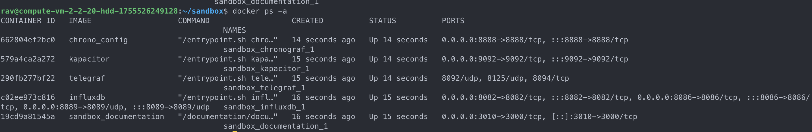
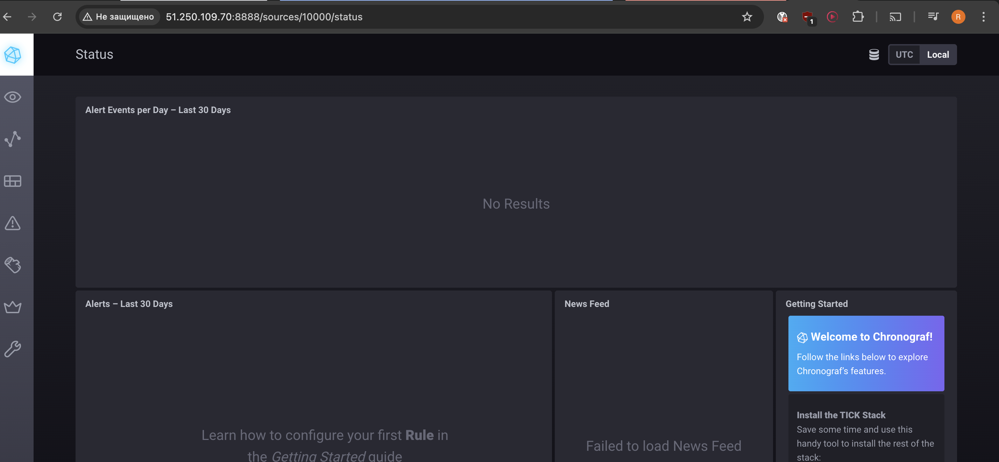
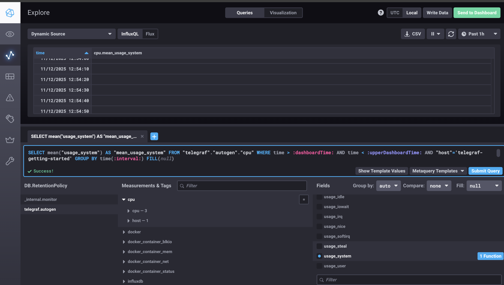
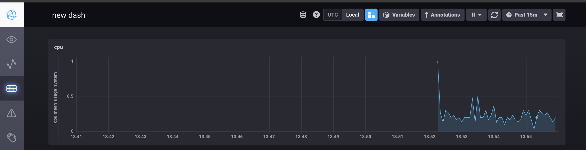

# Домашнее задание к занятию "13.Системы мониторинга"

## Обязательные задания

1. Вас пригласили настроить мониторинг на проект. На онбординге вам рассказали, что проект представляет из себя 
платформу для вычислений с выдачей текстовых отчетов, которые сохраняются на диск. Взаимодействие с платформой 
осуществляется по протоколу http. Также вам отметили, что вычисления загружают ЦПУ. Какой минимальный набор метрик вы
выведите в мониторинг и почему?

  - утилизация дискового пространства
  - утилизация ЦПУ, т.к. вычисления загружают ЦПУ
  - утилизация ОЗУ, несмотря на то, что в задании не уделяется внимание ОЗУ, нехватка оперативной памяти может привести к замедлению работы (например при своппинге) или непредвиденному завершению рабочих процессов ООМ-киллером
  - количество http-запросов за промежуток времени, скорость их обработки, а также метрика в разрезе кодов ответов на запросы и их отношение

#
2. Менеджер продукта посмотрев на ваши метрики сказал, что ему непонятно что такое RAM/inodes/CPUla. Также он сказал, 
что хочет понимать, насколько мы выполняем свои обязанности перед клиентами и какое качество обслуживания. Что вы 
можете ему предложить?

  - необходимо определить бизнес-метрики продукта на основании SLA с отражением пользовательского опыта заказчика, и помимо "технического" дашборда, собрать дашборд с метриками для менеджмента с, например, такими метриками как количество запросов, время обработки запросов, процент времени доступности сервиса. 

#
3. Вашей DevOps команде в этом году не выделили финансирование на построение системы сбора логов. Разработчики в свою 
очередь хотят видеть все ошибки, которые выдают их приложения. Какое решение вы можете предпринять в этой ситуации, 
чтобы разработчики получали ошибки приложения?
  
  - использовал бы построение системы сбора логов бесплатные open-source решения
  - в целях экономии ресурсов, т.к. необходимы только ошибки, собирать будем только их
  - также в целях экономии ресурсов максимально ограничил бы время хранения логов в индексе

#
4. Вы, как опытный SRE, сделали мониторинг, куда вывели отображения выполнения SLA=99% по http кодам ответов. 
Вычисляете этот параметр по следующей формуле: summ_2xx_requests/summ_all_requests. Данный параметр не поднимается выше 
70%, но при этом в вашей системе нет кодов ответа 5xx и 4xx. Где у вас ошибка?

  - возможно у нас присутсвуют редиректы, ответ на которые маркируются кодом 3хх, для правильного расчета, эти запросы следует суммировать с ответами 2хх: (summ_2xx_requests + summ_3xx_requests) / summ_all_requests


#
5. Опишите основные плюсы и минусы pull и push систем мониторинга.

  Плюсы Push:
  - можно отправлять данные в произвольном формате и в любое время, что важно для быстроменяющегося окружения
  - озможность отправка данных по событиям
  - легче работать через NAT и firewall, т.к исходящие соединения обычно разрешены
  - сервер сбора метрик может иметь белый IP, а агенты - нет
  - можно отправлять метрики сразу в несколько систем
  - UDP — это менее затратный способ передачи данных, из-за чего может возрасти

  Минусы Push:
  - Риск потери данных
  - При недоступности системы сбора данные теряются
  - Нет встроенного механизма повторной отправки
  - Трудно отследить, почему данные не дошли
  - Клиенты могут перегрузить сервер

  Плюсы Pull:
  - Контроль над сбором данных
  - Центральный сервер решает когда, что и как часто собирать
  - Легко контролировать нагрузку на систему мониторинга
  - Сервер сам решает, к каким целям подключаться
  - Данные всегда актуальны на момент запроса
  - Можно вручную выполнить запрос к эндпоинту и увидеть данные
  - Понятно, какие узлы доступны, а какие нет

  Минусы Pull:
  - Сложность в динамических окружениях
  - Нужен механизм поиска для автоматического обнаружения, либо заведение каждого узла в ручную
  - Данные обновляются только с частотой опроса
  - Могут пропускаться кратковременные пики, в промежутках между опросом агента

#
6. Какие из ниже перечисленных систем относятся к push модели, а какие к pull? А может есть гибридные?

    - Prometheus
    - TICK 
    - Zabbix 
    - VictoriaMetrics
    - Nagios

  Все перечисленные системы можно считать гибридными, с той оговоркой, что у каждой из систем есть основная модель работы, но возможна работа с другой с определенными условностями, например это pull для prometheus, но и возможна работа в push, с использованием Pushgateway, а, например, для zabbix - это использование разных типов агентов.

#
7. Склонируйте себе [репозиторий](https://github.com/influxdata/sandbox/tree/master) и запустите TICK-стэк, 
используя технологии docker и docker-compose.

В виде решения на это упражнение приведите скриншот веб-интерфейса ПО chronograf (`http://localhost:8888`). 

P.S.: если при запуске некоторые контейнеры будут падать с ошибкой - проставьте им режим `Z`, например
`./data:/var/lib:Z`



#
8. Перейдите в веб-интерфейс Chronograf (http://localhost:8888) и откройте вкладку Data explorer.
        
    - Нажмите на кнопку Add a query
    - Изучите вывод интерфейса и выберите БД telegraf.autogen
    - В `measurments` выберите cpu->host->telegraf-getting-started, а в `fields` выберите usage_system. Внизу появится график утилизации cpu.
    - Вверху вы можете увидеть запрос, аналогичный SQL-синтаксису. Поэкспериментируйте с запросом, попробуйте изменить группировку и интервал наблюдений.





Для выполнения задания приведите скриншот с отображением метрик утилизации cpu из веб-интерфейса.
#
9. Изучите список [telegraf inputs](https://github.com/influxdata/telegraf/tree/master/plugins/inputs). 
Добавьте в конфигурацию telegraf следующий плагин - [docker](https://github.com/influxdata/telegraf/tree/master/plugins/inputs/docker):
```
[[inputs.docker]]
  endpoint = "unix:///var/run/docker.sock"
```

Дополнительно вам может потребоваться донастройка контейнера telegraf в `docker-compose.yml` дополнительного volume и 
режима privileged:
```
  telegraf:
    image: telegraf:1.4.0
    privileged: true
    volumes:
      - ./etc/telegraf.conf:/etc/telegraf/telegraf.conf:Z
      - /var/run/docker.sock:/var/run/docker.sock:Z
    links:
      - influxdb
    ports:
      - "8092:8092/udp"
      - "8094:8094"
      - "8125:8125/udp"
```

После настройке перезапустите telegraf, обновите веб интерфейс и приведите скриншотом список `measurments` в 
веб-интерфейсе базы telegraf.autogen . Там должны появиться метрики, связанные с docker.


