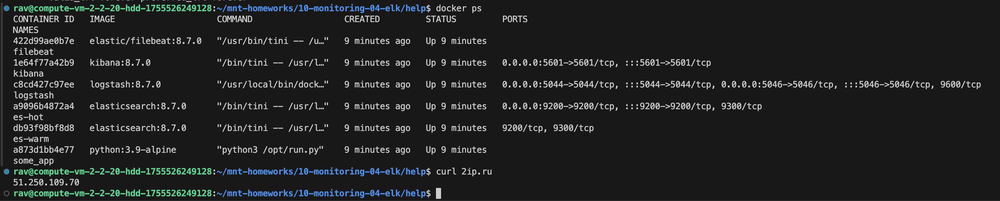
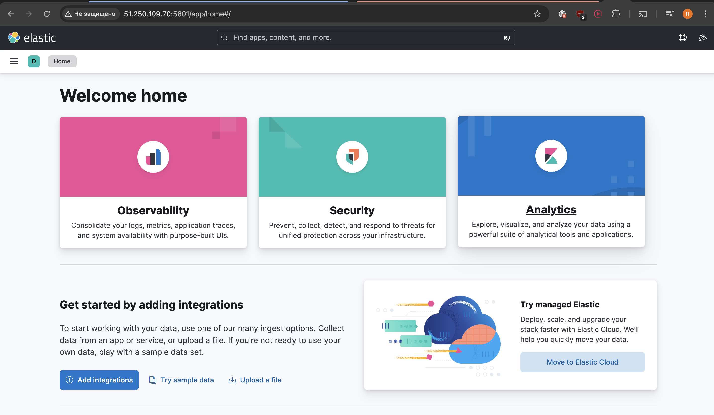
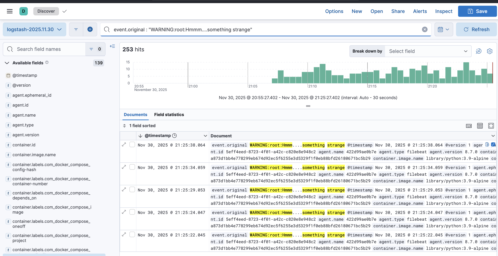
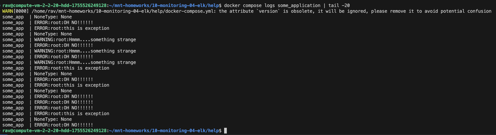
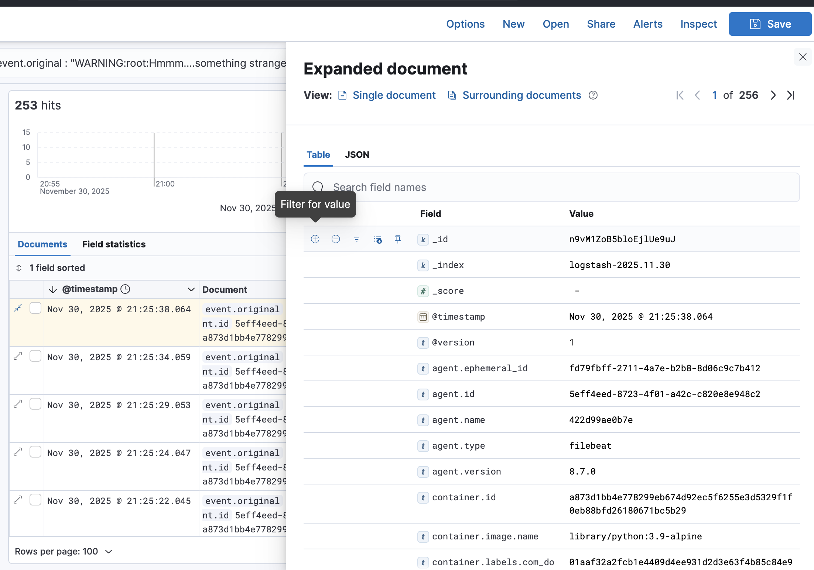

# Домашнее задание к занятию 15 «Система сбора логов Elastic Stack»

## Задание 1

- скриншот `docker ps` через 5 минут после старта всех контейнеров (их должно быть 5);

- скриншот интерфейса kibana;

## Задание 2

